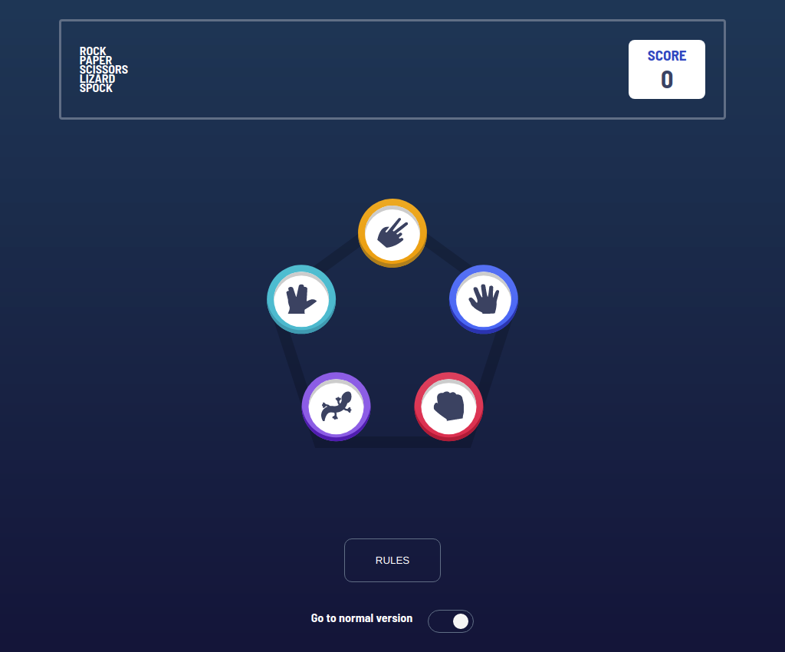
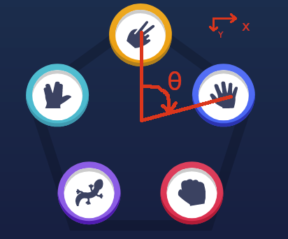

# Rock paper scissors game with extended version



This is a full responsive game with the classic and extensive version of the well known game rock paper and scissors.

This project take the advantage of <span style="color: crimson">CSS in JS</span> using Math library to posicionate the elements.

```
//HandSelection/styles.js
import styled from 'styled-components';

const getPosition = (id, isExtended) => {
  let denominador = 3;
  let hip = -125;
  let offset = -45;
  let iOf = Math.PI / 3;
  if (isExtended) {
    denominador = 5;
    offset = 0;
    iOf = 0;
  }

  let x = -hip * Math.sin(iOf + (2 * Math.PI * id) / denominador);
  let y = hip * Math.cos(iOf + (2 * Math.PI * id) / denominador) + offset;
  let transformation = `translate(${x}px, ${y}px)`;
  return transformation;
};

export const Selection = styled.div`
  position: absolute;
  transform: ${({ id, isExtended }) => getPosition(id, isExtended)};
  width: 90px;
  height: 90px;
  margin: 50px;
  border-radius: 50%;
  `
```

In the code snipet above the function getPosition take the element id and a boolean to determinate if we are displaying 3 or 5 elements. The elements have position absolute relative to the container that wraps the background image and the elements. All elements are centered in the container.

From the center the angle used for the <span style='color:crimson'>cos</span> and <span style='color:crimson'>sin</span> function is taken from the Y axis in clockwise. That means <span style="color:crimson"><span style="text-decoration:underline; color:#14f004">X position</span> it's calculated with the function <span style="text-decoration:underline; color:#14f004">SIN</span></span> <span style="color:crimson">and <span style="text-decoration:underline; color:#14f004">Y position</span> it's calculated with <span style="text-decoration:underline; color:#14f004">COS</span> function.</span>



The CSS transform property provides a translate(x,y) as keyword, and since the starting point its the center the <span style="color:crimson">y position</span> should be negative 'cuz it should go up.

And all the project it's in a single container with condition rendering. For the score, it just uses a context provider.
